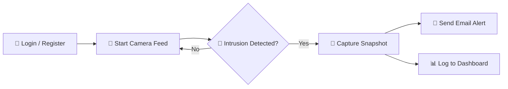

<div align="center">

# 🔐 AI Security System

### Real-Time Intruder Detection powered by Django + OpenCV

*Catch intruders, get instant email alerts, and monitor everything from a sleek dashboard.*

<br/>

[](https://www.python.org/)
[](https://www.djangoproject.com/)
[](https://opencv.org/)
[](LICENSE)

<br/>

[](https://github.com/Sharathmh25/Ai-Security-system/stargazers)
[](https://github.com/Sharathmh25/Ai-Security-system/network/members)
[](https://github.com/Sharathmh25/Ai-Security-system/issues)

</div>

<br/>

---

## 📑 Table of Contents

| | | |
|---|---|---|
| 🌟 [Features](#-features) | 🛠️ [Tech Stack](#️-tech-stack) | 📂 [Project Structure](#-project-structure) |
| 🚀 [Getting Started](#-getting-started) | 🔑 [Environment Variables](#-environment-variables) | ▶️ [Usage](#️-usage) |
| 📸 [Screenshots](#-screenshots) | 🗺️ [Roadmap](#️-roadmap) | 🤝 [Contributing](#-contributing) |
| 📜 [License](#-license) | 👨‍💻 [Author](#-author) | |

---

## 🌟 Features

<table>
<tr>
<td width="50%" valign="top">

### 📸 Smart Capture
Webcam-based image capture using **OpenCV**, triggered automatically on detected activity.

### 🚨 Intrusion Detection
Continuous monitoring that flags unauthorized presence in real time.

### 📧 Instant Email Alerts
Snapshot of the intrusion is emailed immediately via Gmail SMTP — no delays, no missed events.

</td>
<td width="50%" valign="top">

### 📊 Live Dashboard
Centralized view of every alert — **Reported** vs **Safe** — with timestamps and image previews.

### 🔐 Secure Authentication
Login & registration flow keeps the system accessible only to authorized users.

### 🖥️ Clean, Responsive UI
Modern dark-themed interface that updates in real time.

</td>
</tr>
</table>

---

## 🛠️ Tech Stack

<div align="center">

| Layer | Technology |
|:---:|:---:|
| 🐍 **Backend** | Django (Python) |
| 🎨 **Frontend** | HTML · CSS · JavaScript |
| 🗄️ **Database** | MySQL (dev) · PostgreSQL (prod) |
| 👁️ **Computer Vision** | OpenCV |
| ✉️ **Email Service** | Gmail SMTP |

</div>

---

## 📂 Project Structure

```
Main/
├── sensor/          🧠 Core application — models, views, detection logic
├── templates/        🖼️ HTML templates
├── static/            🎨 CSS & JS assets
├── media/             📁 Captured intrusion images
├── manage.py          ⚙️ Django management script
└── requirements.txt   📦 Python dependencies
```

---

## 🚀 Getting Started

### ✅ Prerequisites

- 🐍 Python 3.10+
- 📦 pip
- 🗄️ MySQL or PostgreSQL configured
- 🎥 Webcam-enabled device

### ⚙️ Installation

```bash
# 1️⃣ Clone the repository
git clone https://github.com/Sharathmh25/Ai-Security-system.git
cd Ai-Security-system

# 2️⃣ Create and activate a virtual environment
python -m venv venv
source venv/bin/activate    # Windows: venv\Scripts\activate

# 3️⃣ Install dependencies
pip install -r requirements.txt

# 4️⃣ Configure environment variables (see below)
cp .env.example .env

# 5️⃣ Apply migrations
python manage.py migrate

# 6️⃣ Create an admin user
python manage.py createsuperuser

# 7️⃣ Run the development server
python manage.py runserver
```

> 🌐 The app will be live at **http://127.0.0.1:8000/**

---

## 🔑 Environment Variables

Create a `.env` file in the project root:

```env
SECRET_KEY=your_secret_key
DEBUG=True

# 🗄️ Database
DB_NAME=your_db_name
DB_USER=your_db_user
DB_PASSWORD=your_db_password
DB_HOST=localhost
DB_PORT=5432

# ✉️ Email (Gmail SMTP)
EMAIL_HOST_USER=your_email@gmail.com
EMAIL_HOST_PASSWORD=your_app_password
EMAIL_RECEIVER=alert_recipient@gmail.com
```

> ⚠️ **Security tip:** Use a [Gmail App Password](https://support.google.com/accounts/answer/185833) instead of your real password, and **never** commit `.env` to version control.

---

## ▶️ Usage



1. **Sign in** through the authentication pages.
2. **Start monitoring** from the dashboard — the camera feed activates.
3. The system **continuously watches** for intrusion events.
4. On detection, a **snapshot is captured**, saved to `media/`, and an **email alert** is fired with the image attached.
5. **Review history** anytime from the dashboard — mark events as `Reported` or `Safe`.

---

## 📸 Screenshots

<div align="center">

### 🖥️ Live Alert Dashboard


*Real-time alert feed showing total alerts, safe events, and threats detected — faces blurred for privacy.*

</div>

---

## 🗺️ Roadmap

- [ ] 🎥 Live camera streaming (WebRTC / RTSP)
- [ ] 🧠 AI-based face recognition (known vs. unknown faces)
- [ ] 📱 Mobile app integration with push notifications
- [ ] ☁️ Cloud deployment (AWS / GCP) with CI/CD
- [ ] 💬 SMS alerts via Twilio

---

## 🤝 Contributing

Contributions, issues, and feature requests are welcome! Feel free to check the [issues page](https://github.com/Sharathmh25/Ai-Security-system/issues).

```bash
# 🍴 Fork the repo, then:
git checkout -b feature/your-feature
git commit -m "✨ Add your feature"
git push origin feature/your-feature
# 🔀 Open a Pull Request
```

---

## 📜 License

This project is licensed under the **[MIT License](LICENSE)** — free to use, modify, and distribute.

---

## 👨‍💻 Author

<div align="center">

### **Sharath MH**
*First Year Engineering Student*

[](https://github.com/Sharathmh25)

</div>

---

<div align="center">

⚠️ **Note:** This project is for **educational purposes**. Before any real-world deployment, conduct a full security review covering credential storage, network exposure of the camera feed, and data privacy compliance for recorded footage.

<br/>

**⭐ If you found this project useful, consider giving it a star!**

</div>
